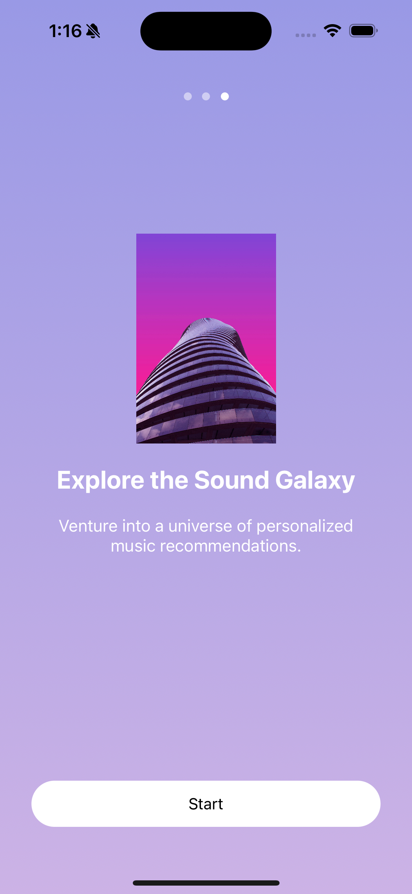

# Cosmora – Mood-Based AI Music Player  

**Cosmora** is an iOS app that enhances user well-being by integrating **Spotify** with **mood detection**. It uses **voice-based emotion recognition** to analyze the user’s mood and plays **Spotify songs accordingly**.  

---

##  How It Works  
1️⃣ The user records their voice using the **Mood Capture** feature.  
2️⃣ The app analyzes the **emotional tone** using **AI**.  
3️⃣ Based on the detected mood, **Spotify suggests and plays music**.  

🔗 **Seamlessly connect your Spotify account** with Cosmora for an **AI-driven music experience**.  

---

##  Key Features  

✅ **Mood Capture** – Analyze emotions through voice recording.  
✅ **Sentiment Beats** – Spotify integration for mood-based music playback.  
✅ **Integrated Spotify Player** – Control music directly within the app.  
✅ **Emotional Compass** *(Under construction)* – Advanced mood tracking.  
✅ **Meditation Mode** *(Under construction)* – Guided relaxation.  
✅ **Future Enhancements** – More AI-powered insights & custom music recommendations.  

---

##  Dataset: RAVDESS Emotional Speech Audio  

Cosmora's **AI-driven mood detection** is powered by the **RAVDESS (Ryerson Audio-Visual Database of Emotional Speech and Song) dataset**, available on **[Kaggle](https://www.kaggle.com/datasets/uwrfkaggler/ravdess-emotional-speech-audio)**.  

### 📌 About RAVDESS  
- Contains **7,356 audio files** featuring **emotional speech and song recordings**.  
- Includes **24 professional actors (12 male, 12 female)** expressing **eight emotions**:  
  - **Neutral, Calm, Happy, Sad, Angry, Fearful, Disgusted, Surprised**.  
- Recorded in **North American English** with **high-quality audio**.  

###  How It’s Used in Cosmora  
✅ **Training AI Models** – The dataset trains the **voice-based emotion recognition model** in **CoreML**.  
✅ **Improving Mood Detection** – Helps fine-tune the app’s ability to detect emotions accurately.  
✅ **Enhancing User Experience** – Ensures the best music is recommended based on real emotional tones.  

---

## Technology Stack  

- **Language**: Swift  
- **Frameworks**: UIKit, AVFoundation, CoreML  
- **AI & Machine Learning**: Voice-based Emotion Detection Model (Trained on **RAVDESS**)  
- **Music API**: Spotify API for song recommendations & playback  

---

##  App Flow  

1️⃣ **Launch Screen** → Welcomes the user to **Cosmora**.  
2️⃣ **Home Screen** → Displays four options:  
   -  **Mood Capture** *(Voice-based emotion analysis)*  
   -  **Emotional Compass** *(Under development)*  
   -  **Meditation Mode** *(Under development)*  
   -  **Sentiment Beats** *(Under development)*  
3️⃣ **Spotify Player (Bottom Tab)** → A central button opens an **integrated Spotify player** to play mood-based songs.  

---

## 📸 Screenshots  

<p align="center">
  
  
  
</p>

<p align="center">
  
  
  
</p>

---

## 🛠️ Installation & Setup  

Clone the repository and open the project in Xcode:  

```bash
git clone https://github.com/programmerwali/Cosmora---Mood-Based-AI-Music-Player
cd Cosmora---Mood-Based-AI-Music-Player
open Cosmora---Mood-Based-AI-Music-Player.xcodeproj
```


- Sign up for a Spotify Developer Account.
- Create an app in the Spotify Developer Dashboard.
- Copy the Client ID & Secret into the project’s configuration.
- Ensure Spotify authentication is handled properly.


Want to improve Cosmora? Fork, submit PRs, or open issues! 

📄 License

This project is MIT Licensed. Feel free to use and modify it.


