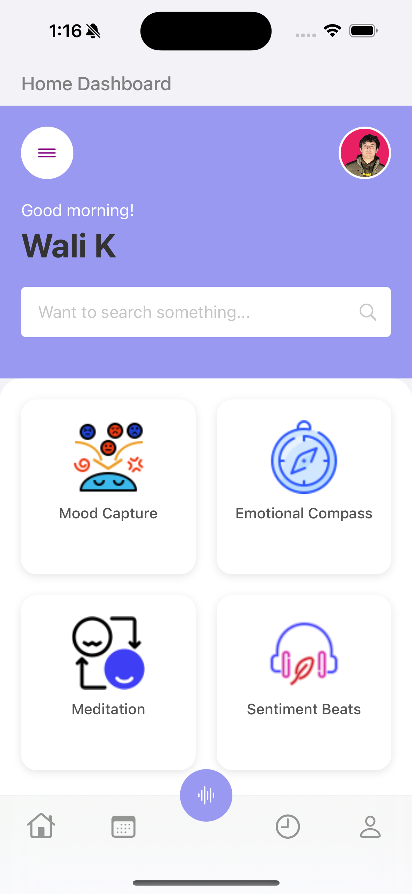
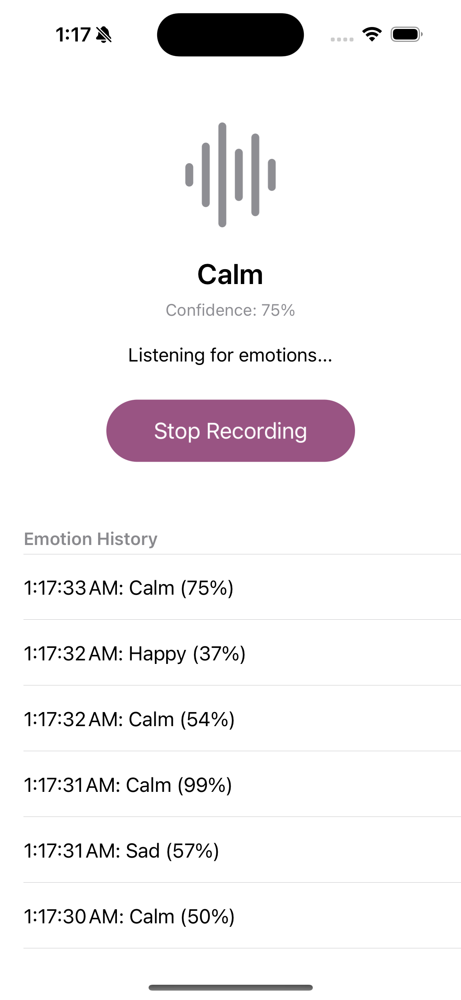
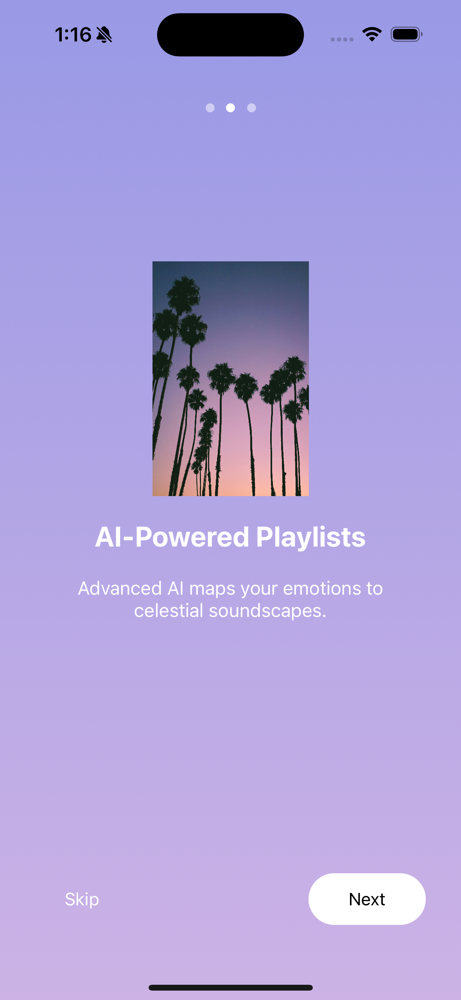
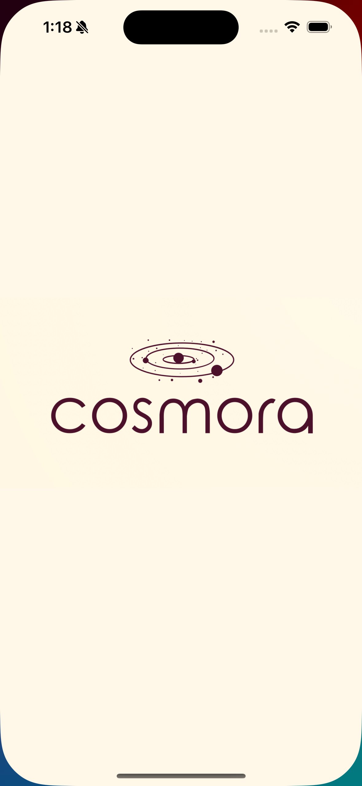
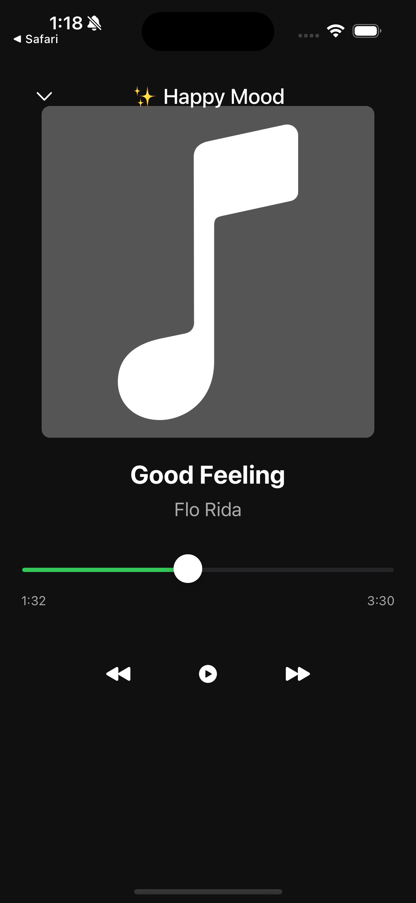

Cosmora – Mood-Based Spotify Music Player

Cosmora is an iOS app that enhances user well-being by integrating Spotify with mood detection. It uses voice-based emotion recognition to analyze the user’s mood and plays Spotify songs accordingly.

 How it Works:
1️⃣ The user records their voice using the Mood Capture feature.
2️⃣ The app analyzes the emotional tone using AI.
3️⃣ Based on the detected mood, Spotify suggests and plays music.

🔗 Seamlessly connects your Spotify account with Cosmora to create an AI-driven music experience.

Key Features

✅  Mood Capture: Analyze emotions through voice recording.
✅  Sentiment Beats: Spotify integration for mood-based music playback.
✅  Integrated Spotify Player: Control music directly within the app.
✅  Emotional Compass: (Under construction) Advanced mood tracking.
✅  Meditation Mode: (Under construction) Guided relaxation.
✅  Future Enhancements: More AI-powered insights & custom music recommendations.

Technology Stack

Language: Swift
Frameworks: UIKit, AVFoundation, CoreML
AI & Machine Learning: Voice-based Emotion Detection Model
Music API: Spotify API for song recommendations & playback
App Flow

1️⃣ Launch Screen → Welcomes the user to Cosmora.
2️⃣ Home Screen → Displays four options:

    Mood Capture 🎤 (Voice-based emotion analysis)
    Emotional Compass 🧭 (Under development)
    Meditation Mode 🧘 (Under development)
    Sentiment Beats 🎵 (Under development)
    
3️⃣ Spotify Player (Bottom Tab) 
A central button opens an integrated Spotify player to play mood-based songs.
Screenshots

## Screenshots

### Home Screen

### Emotion Detection

### Launch Screen

### Loading Screen

### Music Screen

Installation & Setup

Clone the repository and open the project in Xcode:

git clone https://github.com/programmerwali/Cosmora.git
cd Cosmora
open Cosmora.xcodeproj
Spotify API Setup

Sign up for a Spotify Developer Account: Spotify Developer
Create an app in the Spotify Developer Dashboard.
Copy the Client ID & Secret into the project’s configuration.
Ensure Spotify authentication is handled properly.
Future Enhancements

🚀 Improved AI emotion detection for better accuracy.
🎵 Custom playlists based on historical mood trends.
🌎 Social sharing to connect users with similar music preferences.
📊 Mood insights dashboard for tracking emotions over time.

💡 Contributing

Want to improve Cosmora? Feel free to fork, submit PRs, or open issues! 🚀

📄 License

This project is MIT Licensed. Feel free to use and modify it.
